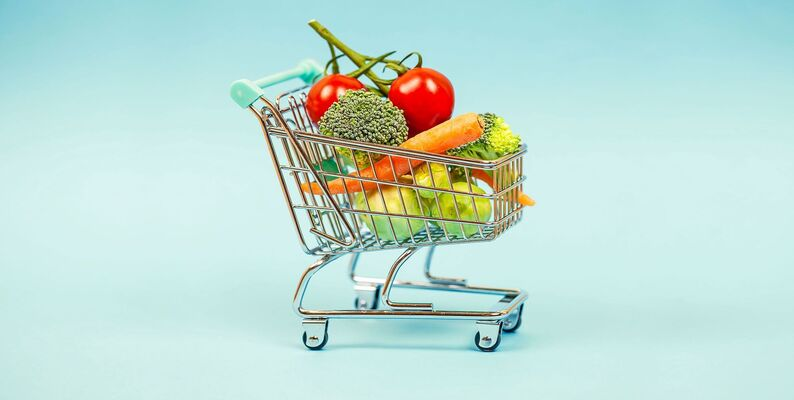

# GP3



**Instacart** — крупнейший маркетплейс доставки продуктов в США/Канаде. В открытом доступе лежит массив из примерно 3 млн заказов 200 тыс. пользователей и 49 тыс. товаров — «Instacart Online Grocery Shopping Dataset 2017».
**Бизнес-цель:** увеличить LTV и GMV, предложив каждому клиенту правильные товары в правильный момент, тем самым:
  - поднять средний чек и конверсию «добавить в корзину»;
  - сократить стоимость коммуникаций и промо;
  - повысить коэффициент повторных покупок.
Мы решаем две взаимодополняющие задачи:
1. **Reorder Score** — оценка вероятности, что товар снова окажется в корзине.
2. **Next-Basket Recommendation** — генерация персонального ТОП-K списка «что купить дальше» на основе последовательности прошлых заказов.
   
---

1. **Задача A «Reorder Score»**
- Бизнес-вопрос «Какие из ранее купленных товаров пользователь перезакажет с наибольшей вероятностью?»
- ML-формулировка Бинарная классификация для пары (user, product); целевая переменная reordered ∈ {0, 1}
- Основные фичи RFM-метрики, интервалы между покупками, недельная/часовая сезонность, категорийные признаки, корзинные правила (support / lift), личная история клиента
- Метрики ROC-AUC, PR-AUC; бизнес-метрика — lift в Top-N подсказках
- Модели для сравнительного анализа:
  1. Random Forest
  2. k-NN
  3. Naïve Bayes
  4. LightGBM GBDT
  5. MLP-Classifier (одно скрытое слой, ReLU)
Ожидаемый эффект +4-6% позиций в средней корзине, −15 % затрат на пуши за счёт таргетинга

---

2. **Задача B «Next-Basket Recommendation»**
- Бизнес-вопрос «Что предложить клиенту прямо сейчас с оглядкой на последовательность его покупок?»
- ML-формулировка Последовательное предсказание: хроника S = [i₁,i₂,…,i_t] -> rank K items for t+1
- Метрики Recall@K, NDCG@K
- Используемые модели:
  1. GRU4Rec (baseline RNN)
  2. SASRec — self-attention seq2seq
  3. BERT4Rec — двусторонний Transformer с Cloze-маскировкой, state-of-the-art  
Интерпретация Attention-heatmap показывает, какие прошлые товары повлияли на рекомендацию
Ожидаемый эффект +8-10% к повторным покупкам, рост LTV на 5-7 %

---

### Как работать с репозиторием
1. Первым делом перейдите по ссылке на наши [данные](https://www.kaggle.com/datasets/yasserh/instacart-online-grocery-basket-analysis-dataset) и скачайте все 6 файлов.
2. После этого запустите установку всех необходимых библиотек из файла requirements.txt
   ```
   pip install -r requirements.txt
   ```
3. Далее скачайте и запустите файл [Preprocess_data.ipynb](Preprocess_data.ipynb). Данный файл соединит все наши данные в единый датасет и сохранит в файл InstCart.csv, при желании вы можете настроить объем выходных данных в ячейке перед сохранением. В нашем варианте мы взяли данные по 500 пользователям и их 200 последних покупок.
4. После этого перейдем к ML части, для этого скачайте, а затем запустите файл
5. Последней частью проекта станет запуск файла [InstaCart_DL.ipynb](DL/InstaCart_DL.ipynb) вместе с этим файлом необходимо загрузить все файлы с расширением .yaml, они являются конфигурациями используемых в проекте моделей.
